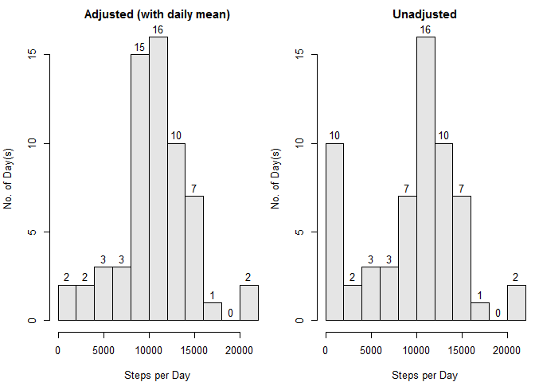

# Reproducible Research: Peer Assessment 1
lawrence009  


## Loading and preprocessing the data

```r
subject <- read.csv('activity.csv')
    
subject$datetime <- strptime(paste(subject$date, sprintf('%04d', subject$interval)),
                             '%F %H%M')
subject$date     <- as.Date(subject$date)
subject$interval <- as.factor(subject$interval)

# 0=Sunday, 6=Saturday
is.weekend <- function(wday) {
    if (wday == 0 | wday == 6) {
        TRUE
    } else {
        FALSE
    }
}

subject$wknd <- sapply(subject$datetime$wday, is.weekend)


#total number of steps per day
total.steps.day <- tapply(subject$steps, subject$date, sum, na.rm = T)

#avg number of steps per 5-minute interval
avg.steps.interval <- tapply(subject$steps, subject$interval, mean, na.rm = T)
```


## What is mean total number of steps taken per day?

```r
par(mar = c(4, 4, 2, 0) + 0.1,
    cex = 0.8)

hist(total.steps.day, breaks = 10,
     main = 'Histogram of Steps Taken per Day',
     xlab = 'Steps per Day', ylab = 'No. of Day(s)',
     labels = T,
     col = 'grey90')
```

 

```r
mean(total.steps.day)
```

```
## [1] 9354.23
```

```r
median(total.steps.day)
```

```
## [1] 10395
```


## What is the average daily activity pattern?

```r
df <- data.frame(time = seq(from = 0, by = 5, length.out = 288),
                 avg.steps = avg.steps.interval)

par(cex = 0.8)

plot(df,
     type = 'l',
     main = 'Average Daily Acitivity Pattern over Two Months',
     xlab = 'Elapsed Time (minutes) per Day',
     ylab = 'Avg. Step per 5-minute Interval')
```

 

_Note:_ coercing interval values 0, 5, 15, ... 1050, 1055, 1100, ... into
numeric x-axis values produces a time-series plot of similar pattern but
slightly different shape.  This student feels it is more accurate to
plot x-values as a straight index of 1:288 or the minute-interval
equivalents.


```r
#maximum steps from average daily interval
max.steps <- max(df$avg.steps)
max.steps
```

```
## [1] 206.1698
```

```r
#peak interval (elapsed time in minutes)
peak.interval <- df$time[df$avg.steps == max.steps]
peak.interval
```

```
## [1] 515
```

```r
#peak hour
peak.hour <- row.names(df)[df$avg.steps == max.steps]
peak.hour
```

```
## [1] "835"
```

## Imputing missing values

```r
#number of missing value by date
tapply(subject$steps,
       subject$date,
       function(x) sum(is.na(x)) )
```

```
## 2012-10-01 2012-10-02 2012-10-03 2012-10-04 2012-10-05 2012-10-06 
##        288          0          0          0          0          0 
## 2012-10-07 2012-10-08 2012-10-09 2012-10-10 2012-10-11 2012-10-12 
##          0        288          0          0          0          0 
## 2012-10-13 2012-10-14 2012-10-15 2012-10-16 2012-10-17 2012-10-18 
##          0          0          0          0          0          0 
## 2012-10-19 2012-10-20 2012-10-21 2012-10-22 2012-10-23 2012-10-24 
##          0          0          0          0          0          0 
## 2012-10-25 2012-10-26 2012-10-27 2012-10-28 2012-10-29 2012-10-30 
##          0          0          0          0          0          0 
## 2012-10-31 2012-11-01 2012-11-02 2012-11-03 2012-11-04 2012-11-05 
##          0        288          0          0        288          0 
## 2012-11-06 2012-11-07 2012-11-08 2012-11-09 2012-11-10 2012-11-11 
##          0          0          0        288        288          0 
## 2012-11-12 2012-11-13 2012-11-14 2012-11-15 2012-11-16 2012-11-17 
##          0          0        288          0          0          0 
## 2012-11-18 2012-11-19 2012-11-20 2012-11-21 2012-11-22 2012-11-23 
##          0          0          0          0          0          0 
## 2012-11-24 2012-11-25 2012-11-26 2012-11-27 2012-11-28 2012-11-29 
##          0          0          0          0          0          0 
## 2012-11-30 
##        288
```

```r
#total number of missing values
sum(is.na(subject$steps))
```

```
## [1] 2304
```

Since the missing values are in daily groups of 288, they can be replaced using
either previously calculated avg.steps.interval (5-min interval) or average
total steps from the 61-day study.  It is also worth noting that the missing
values are not always on weekends.


```r
#new data set; prefix t = transformed
t.subject <- subject
#t.subject$steps[(which(is.na(t.subject)))] <- avg.steps.interval
t.subject$steps[(which(is.na(t.subject)))] <- mean(total.steps.day) / 288

#total number of steps per day
t.total.steps.day <- tapply(t.subject$steps, t.subject$date, sum, na.rm = T)

par(mar   = c(4, 4, 2, 0) + 0.1,
    mfcol = c(1, 2),
    cex   = 0.8)

#after
hist(t.total.steps.day, breaks = 10,
     main = 'Adjusted (with daily mean)',
     xlab = 'Steps per Day', ylab = 'No. of Day(s)',
     labels = T,
     col = 'grey90')

#before
hist(total.steps.day, breaks = 10,
     main = 'Unadjusted',
     xlab = 'Steps per Day', ylab = 'No. of Day(s)',
     labels = T,
     col = 'grey90')
```

 

```r
#unadjusted
mean(total.steps.day)
```

```
## [1] 9354.23
```

```r
#adjusted
mean(t.total.steps.day)
```

```
## [1] 10581.01
```

```r
#unadjusted
median(total.steps.day)
```

```
## [1] 10395
```

```r
#adjusted
median(t.total.steps.day)
```

```
## [1] 10395
```


## Are there differences in activity patterns between weekdays and weekends?

```r
t.subject$wknd <- factor(t.subject$wknd,
                         levels = c(T, F),
                         labels = c('weekend', 'weekday'))

df <- aggregate(t.subject$steps,
                by = list(t.subject$interval, t.subject$wknd),
                mean)

colnames(df) <- c('interval', 'wkd', 'avg.steps')

df$time <- seq(from = 0, by = 5, length.out = 288)

library(lattice)
xyplot(avg.steps ~ time | wkd, data = df,
       type = 'l',
       layout = c(1, 2),
       par.strip.text = list(cex = c(0.8)),
       scales = list(cex = c(0.8, 0.8)),
       xlab   = list('Elapsed Time (minutes) per Day', cex = 0.8),
       ylab   = list('Avg. Step per 5-minute Interval', cex = 0.8))
```

 

***

## Addendum

### Comparison between the shapes of time-series line plot: time-values vs.
coercing interval labels into numeric


```r
par(cex = 0.8,
    xaxt = 'n')

plot(x = seq(from = 0, by = 5, length.out = 288),
     y = avg.steps.interval,
     type = 'l',
     col  = 'red',
     main = 'Average Daily Acitivity Pattern over Two Months',
     xlab = 'Time',
     ylab = 'Avg. Step per 5-minute Interval')

lines(x = as.numeric(names(avg.steps.interval)) / 2400 * 1440,
      y = avg.steps.interval,
      col = 'blue')

legend('topright',
       legend = c('time-value', 'coericing'),
       col = c('red', 'blue'),
       lty = 1,
       bty = 'n')
```

 


### Imputing missing value using average steps from each 5-minute interval vs.
average daily total steps

```r
m <- matrix(nrow = 2, ncol = 2,
            data = c(mean(subject$steps, na.rm = T), 
                     mean(total.steps.day) / 288,
                     median(subject$step, na.rm = T),
                     median(total.steps.day) / 288),
            dimnames = list(c('(i) interval',
                              '(d) daily average'),
                            c('mean', 'median')))

#3 different ways to imput NA
print(m)
```

```
##                       mean   median
## (i) interval      37.38260  0.00000
## (d) daily average 32.47996 36.09375
```

```r
#daily average
i.mean <- total.steps.day
i.mean[i.mean == 0] <- m[1, 1] * 288

d.mean <- total.steps.day
d.mean[d.mean == 0] <- m[2, 1] * 288

d.median <- total.steps.day
d.median[d.median == 0] <- m[2, 2] * 288


par(mfcol = c(1, 3))

hist(i.mean, breaks = 10)
hist(d.mean, breaks = 10)
hist(d.median, breaks = 10)
```

 

```r
#average daily pattern
i.mean <- avg.steps.interval
i.mean[i.mean == 0] <- m[1, 1]

d.mean <- avg.steps.interval
d.mean[d.mean == 0] <- m[2, 1]

d.median <- avg.steps.interval
d.median[d.median == 0] <- m[2, 2]


par(mfcol = c(1, 1),
    mar = c(2, 2, 0, 0) + 0.1,
    cex = 0.8)

plot(x=seq(from = 0, by = 5, length.out = 288),
     i.mean,
     type = 'l')

points(seq(from = 0, by = 5, length.out = 288),
     d.mean,
     type = 'l',
     col = 'red')

points(seq(from = 0, by = 5, length.out = 288),
     d.median,
     type = 'l',
     col = 'blue')

legend('topright', bty = 'n', lty = 1,
       col = c('black', 'red', 'blue'),
       legend = c('i.mean', 'd.mean', 'd.median'))
```

 

No significant difference in the three methods.
